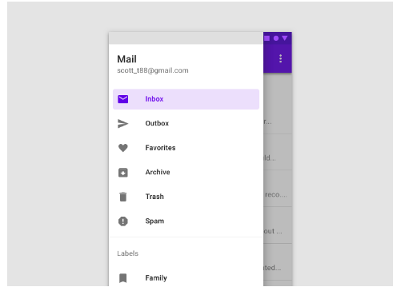

# Training_Navigation_drawer

## I.Các khái niệm
### 1.Định nghĩa
Navigation Drawer là một menu kéo hiện thị như là một ngăn xếp ở cách cạnh biên của màn hình.
 Nó được ẩn đi khi không sử dụng, nhưng sẽ xuất hiện khi người sử dụng vuốt ngón tay của họ từ mép trái, mép trên của màn hình ứng dụng hoặc người sử dụng trạm vào icon trên thanh công cụ.

### 2. Sử dụng
Nên dùng khi: 
App với 5 hoặc hơn điểm đến top-level

Điểm đến chính
App với 2 hoặc hơn level của cấu trúc navigation
Di chuyển nhanh giữa các thành phần không liên quan tới nhau

Không nên dùng chung với 1 cái thành phần chính khác, như bottom navigation

### 3. Quy tắc thiết kế

- Xác định được: vị trí và phong cách của list nội dung phải dễ nhận đó là navigation drawer

- Có tính tổ chức: xếp theo độ quan trọng, cái hay dùng trước và những group những việc liên quan đến nhau

- Tính ngữ cảnh: có thể được ẩn/hiện tùy thuộc vào ngữ cảnh

### 4. Phân loại

### a. Loại cơ bản
- Cho phép người dùng đồng thời truy cập tới nội dung trong drawer và app

- Có thể được ẩn hiện bằng nhấn icon navigation ở menu

- Dùng trên tablet, desktop

### b.Loại modal

Chỉ hiện ở 1 phần màn hình, phần còn lại không tương tác được

Thường dùng cho điện thoại

### c. Loại Bottom

Là loại đặc biệt của modal, hiển thị từ dưới lên

Thường dùng với bottom app bar

### 5. Cấu trúc
Một list của các item dưới dạng bảng, có thể thêm header hoặc divider

Container

Tiêu đề (tùy chọn)

Divider (tùy chọn)

Overlay cho item đang được chọn

Item đang được chọn

Item ko được chọn

Phụ đề

Scrim (chỉ cho loại modal)

### 6. Chi tiết
### a. Loại cơ bản
Thay thế
Loại modal: 

Trong lưới bố trí đáp ứng, tại điểm dừng tối thiểu xác định có chiều rộng tối thiểu 600dp, nên thay thế ngăn kéo tiêu chuẩn bằng ngăn kéo phương thức.

Ngăn kéo có thể nhìn thấy vĩnh viễn: Khi người dùng cần chuyển đổi điểm đến thường xuyên (và kích thước màn hình cho phép), có thể sử dụng ngăn kéo có thể nhìn thấy vĩnh viễn.

Ngăn kéo có thể dismiss: Một ngăn kéo có thể dismiss tập trung vào nội dung màn hình và yêu cầu ít truy cập hơn vào các điểm đến điều hướng của nó.

### b. Loại Modal

- Luôn block tương tác với phần còn lại của app bằng một lớp phủ. Dùng chủ yếu cho mobile

- Mở bằng cách nhấn vào navigation icon ở top bar

- Dismiss bằng cách:

+ Nhấn vào item

+ Chạm vào vùng mờ

+ Vuốt từ phải sang trái

### c. Loại bottom

- Hiển thị từ phần dưới của màn hình lên, chỉ dùng với bottom app bar

- Chỉ dùng cho điện thoại

### 6. Trạng thái

1. Activated

Màn hình hiện tại, hoặc cha mẹ của nó, được thể hiện với trạng thái kích hoạt.

Trạng thái này phải có độ tương phản thị giác mạnh từ các mục chưa được kích hoạt. 

Mỗi lần chỉ có thể kích hoạt một mục trong ngăn kéo điều hướng.

2. Inactive

Không hoạt động là trạng thái mặc định cho các mục trong ngăn kéo điều hướng.

3.Focus

4.Press

5.Hover

## II. Triển khai
